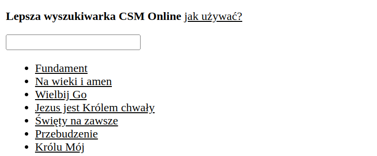

This is a web service for searching the [CSM/online](https://csmonline.edu.pl) platform - very popular Polish
worship tutorials database.

Their website has a very lacking search functionality. So I created a scraper, that indexes all the links.
Then, a simple webapp with better client-side search can be used to find them faster.

You can try it out via usual `npm start`. Updating the index of all the links
(you might have to update `LAST_PAGE_NUMBER` in scraper source) can be done with
`EMAIL="heregoes@email.com" PASSWORD="heregoespassword" ./gradlew run` (use Java 8).

